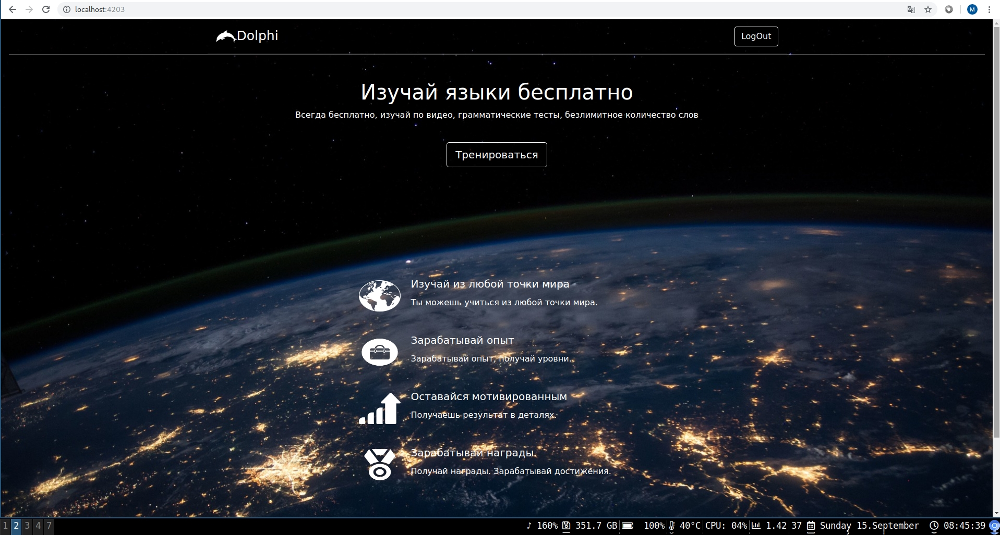
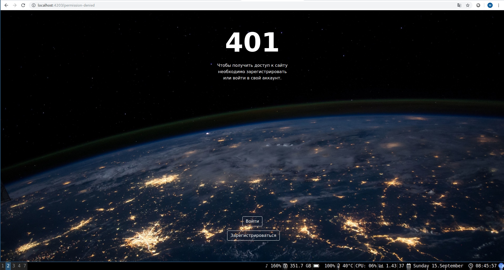
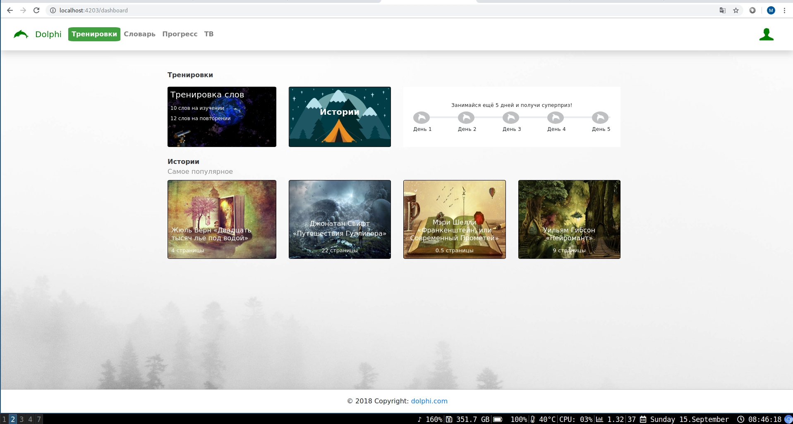
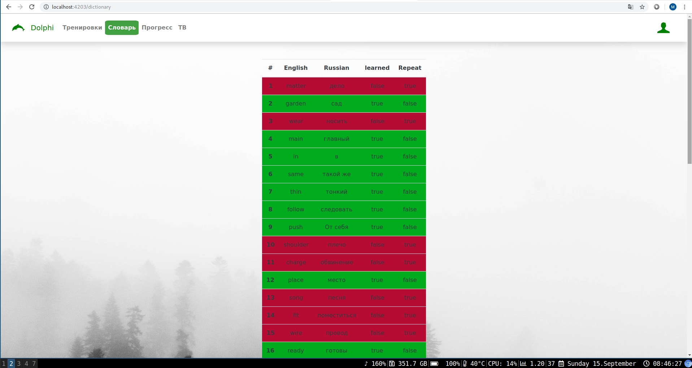
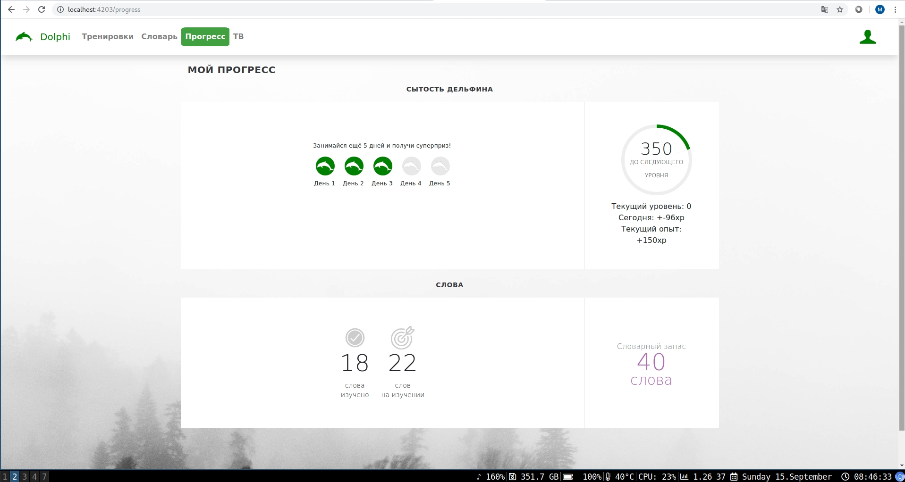
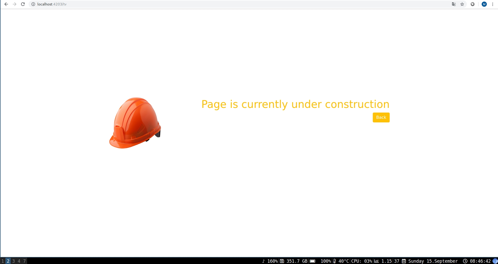
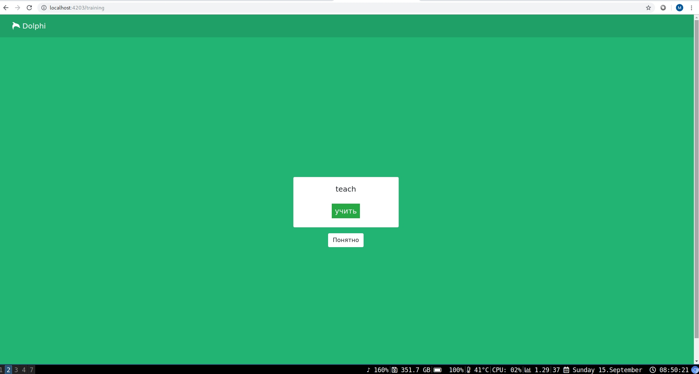

# learn-foreign-languages

<h2>Describe</h2>
 App for learning foreign languages

 App is developing...

<h2>Screenshots</h2>            

<kbd></kbd>
<kbd></kbd>
<kbd></kbd>
<kbd></kbd>
<kbd></kbd>
<kbd></kbd>
<kbd></kbd>

<h2>Start app</h2>

0. Get project

           $ git clone https://github.com/Bananiys202024/learn-foreign-languages
           cd learn-foreign-languages
 
1. Start back-end

           ./gradlew bootJar           
            docker-compose build
            docker-compose up
            
2. Start front-end 

            cd client
            npm install
            ng serve --port 4203
            
3. Go to <a href="http://localhost:4203/">http://localhost:4203/</a>

<h2>Tutorials "How use" with "Arch Linux"</h2>

<h3>Docker</h3>

Clear all started containers

            docker rm -f $(docker ps -a -q) 	

Start(long note)

            ./gradlew bootJar

            docker-compose build

            docker-compose up
            
Start(short note)
    
            ./gradlew bootJar;docker-compose build;docker-compose up;

or

            sudo ./gradlew bootJar;sudo docker-compose build;sudo docker-compose up;

<h3>Redis</h3>

Start

            redis-cli
 
Revise all keys

            redis-cli --scan --pattern '*'
            
Revise type of key "Anton"

            type Anton
            
Check TTL of key "mykey"

            TTL mykey  

Set TTL to key "mykey" in seconds

            EXPIRE mykey 10

Delete key "mykey"
          
            del mykey
            
Read hash key "mykey"
 
            HGETALL mykey

Redis Sets are unordered collections of strings. The SADD command adds new elements to a set. It's also possible to do a number of other operations against sets like testing if a given element already exists, performing the intersection, union or difference between multiple sets, and so forth. Following command create unordered collections "myset"

            sadd myset 1 2 3

Get sets or get unordered collections of strings "myset"

            smembers myset
            
Redis is free to return the elements in any order at every call
This is a good time to introduce the set command that provides the number of elements inside a set. This is often called the cardinality of a set in the context of set theory, so the Redis command is called SCARD.
Get number elements of set "myset"

             scard myset

<h3>Mongodb</h3>

Show all databases

            show dbs; 	

Use database "tongues"

           use tongues
           
Show tables

           show tables
 
Show content of table "users"
   
           db.users.find({})
           
Show content of table "users"
   
           db.users.find()
           
Show define content of table "users", only with value "Mortal" in column "username"
             
           db.users.find({"username": "Mortal"})

Show define content of table "users", only with value "Mortal" in column "username" 
and with value IamDisabledUser" in column email

           db.users.find({"email": "IamDisabledUser", "username":"Mortal"})

Get number of lines in table "users"

           db.users.count();
  
Revise content of table "users"

           db.users.find();
           
Drop database "tongues"

           use tongues       
           db.dropDatabase()
           
           
 
<h2>Access</h2>

Back-end:  <a href="http://localhost:8083/">http://localhost:8083/</a>  
Front-end: <a href="http://localhost:8083/">http://localhost:4203/</a>
 
